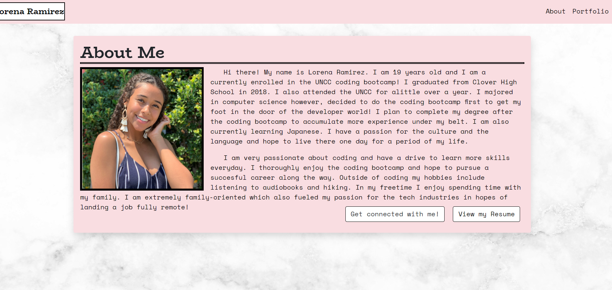
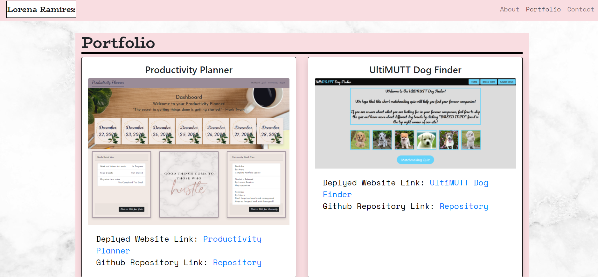
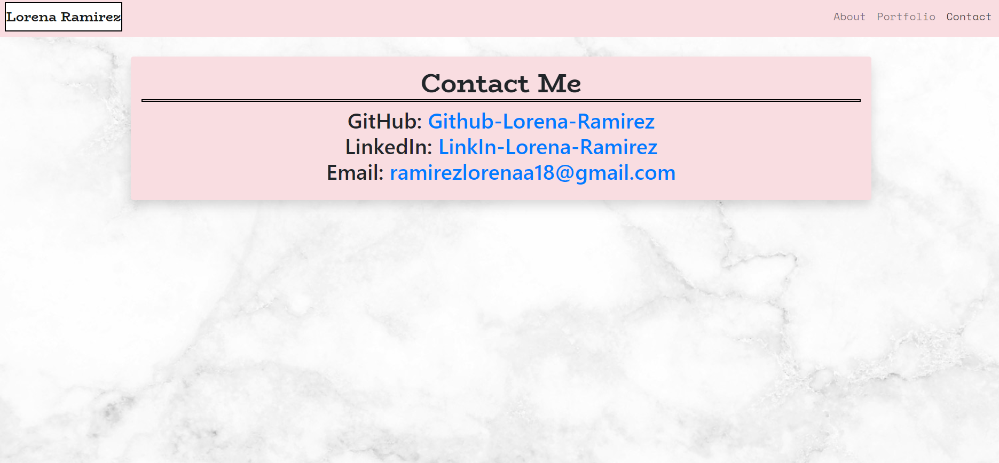

# Employee-Directory
## Description
  ---
  This portfolio is a replication of my original portfolio. However, it was restructured into a react app! The porfolio has the same functionalities which is to dispaly my projects resume, and contact information except I used my new skills in react to create a more up to date portfolio
  ## Table of Contents 
  --- 
  [Application](#application)

  [Usage](#usage)

  [Contributing](#contributing)

  [Questions](#questions)

  [Link](#deployedLink)

  ## Application
  ---
  
  
  

  ## Usage
  ---
  * View my bio as well as resume by staying on the about page and clicking view resume button
  * View my collection of projects by clicking the portfolio tab in the navbar.
  * Each project has links below to the deployed website as well as the repository for that website

  ## Contributing
  ---
  * Lorena Ramirez
  ## Questions
  ---
  To reach me with additional questions please contact me with one of the following below.
  * My github profile - [Github Link](https://github.com/Lorena-Ramirez)
  * Email - <ramirezlorenaa18@gmail.com>

 ## Link
  ---
  [Deployed Site](https://react-portfolio-app1.herokuapp.com/)
